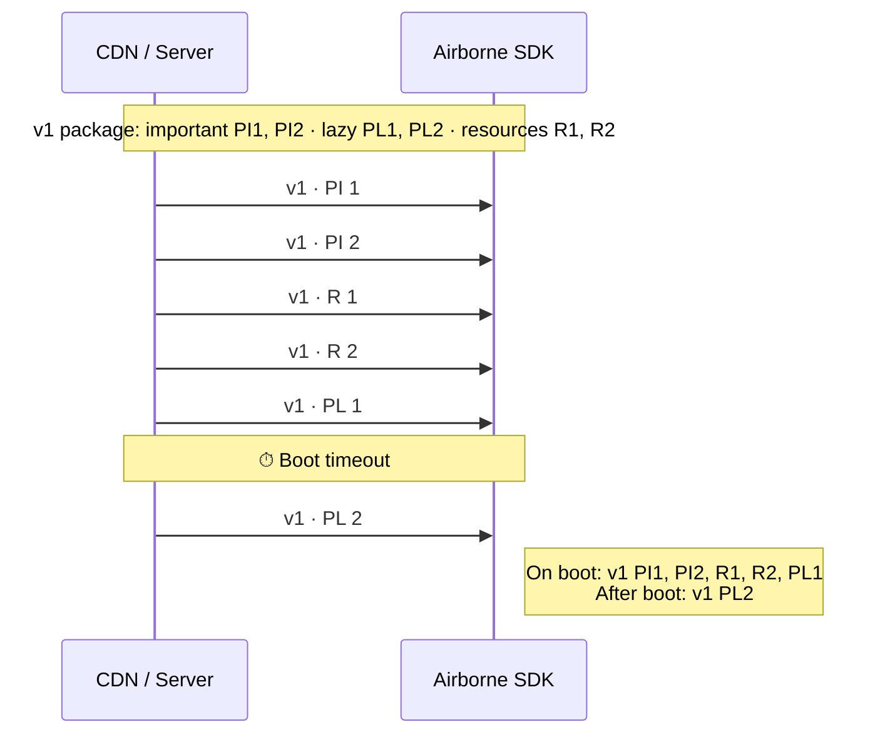
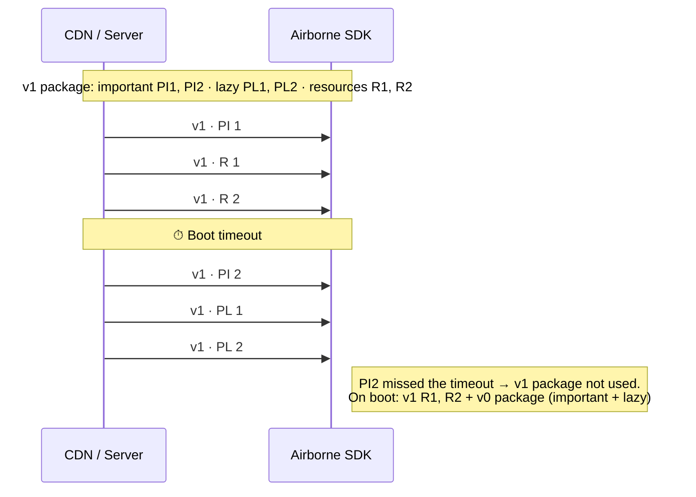
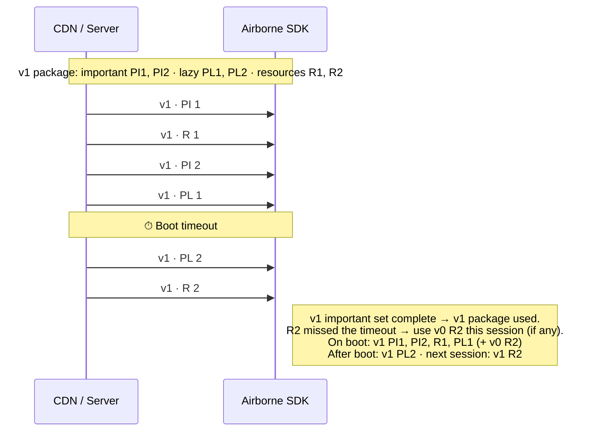

At boot the SDK fetches the [release config](/docs/intro#core-concepts) and starts downloading the current package's files and the release's resources. What the app boots with depends on **which files arrive before the boot timeout**:

- **Important files** (`package.important`) — the package is only used if *all* of them arrive before the boot timeout. If any is late, the SDK falls back to the previously booted package.
- **Lazy files** (`package.lazy`) — extend the package but do not block boot; whatever hasn't arrived by the timeout keeps downloading in the background and becomes available afterwards.
- **Resources** — standalone files that work in any combination; each one that arrives before the timeout is used this session, and any that miss it fall back to the previous version's copy (if any) and become available next session.

The three cases below use a package with 2 important files (`PI 1`, `PI 2`), 2 lazy files (`PL 1`, `PL 2`), and 2 resources (`R 1`, `R 2`), all from version `v1`.

## Case 1 — Happy case

The entire `package.important` block arrives before the boot timeout, so the `v1` package is used.

Both important files made it, so the app boots on `v1`. `PL 2` arrived after the timeout and is loaded once available.

## Case 2 — Package timeout

If the `package.important` block is **not** completely downloaded in time, the whole `v1` package is discarded for this session and the SDK serves the **previous package (`v0`)** — its important and lazy files — instead. Resources that did arrive are still used.

`PI 2` crossed the boot timeout, so the important set was incomplete and the app boots on the last good package (`v0`). The already-downloaded `v1` resources (`R 1`, `R 2`) are still available.

## Case 3 — Resource timeout

Here both important files arrive in time, so the `v1` package **is** used — but a resource misses the timeout. Resources are independent, so only the late one falls back to the previous version for this session; the fresh copy is picked up next session. This keeps file reads within a single session idempotent.

:::tip[Tuning the timeout]
The boot timeout and the release-config fetch timeout are set per release (`boot_timeout` and `release_config_timeout`). A longer boot timeout lets more files land before boot at the cost of a slower cold start; see [Create a release](/docs/api-reference/endpoints/create-release).
:::
